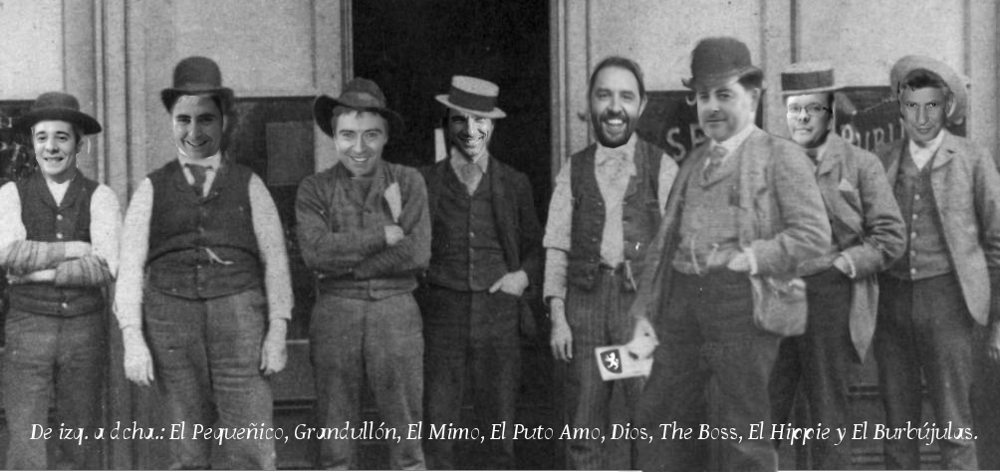

**Fun with migasfree**{: .part}

{: .center style="height=20%;width:20%;border-width: 0px;"}

# Sobre este libro

## Licencia y Copyright

> Fun with migasfree
>
> Copyright (C) 2013 - 2020 Alberto Gacías and contributors. Permission
> is granted to copy, distribute and/or modify this document under the
> terms of the GNU Free Documentation License, Version 1.3 or any later
> version published by the Free Software Foundation; with no Invariant
> Sections, no Front-Cover Texts, and no Back-Cover Texts. A copy of the
> license is included in the section entitled "GNU Free Documentation
> License".

## Presentación

{: .center}

*Hola. Soy Alberto Gacías. Bienvenidos al primer capítulo de "Alberto
Gacías presenta diversión con migasfree". Durante las próximas páginas,
usted y yo vamos a explorar el dinámico mundo de la migasfreelogía[^1].*{: .center}

### ¿Qué es migasfree en cuatro palabras?

**Un gestor de despliegues**.

Me atrevo incluso con sólo una palabra: **Desplegador**.

[Migasfree](http://migasfree.org) se ocupa principalmente del proceso de
la liberación de software y de la posterior auditoría de los cambios
producidos en los equipos como consecuencia de esa liberación.

Es una de las herramientas que estamos utilizando con éxito en
[AZLinux](http://zaragozaciudad.net/azlinux/), el proyecto de migración
a escritorio libre del [Ayuntamiento de Zaragoza](http://zaragoza.es).

Este software se ha hecho indispensable en nuestro día a día, y creo que
es una buena solución para personalizar y administrar escritorios de
forma eficaz.

{: .center style="height=20%;width:20%;"}

### ¿Para qué sirve migasfree?

-   Para administrar ordenadores de forma centralizada.
-   Desplegar actualizaciones según calendarios y características de
    ordenadores y usuarios.
-   Controlar y personalizar cada ordenador, manteniendo íntegros tus
    sistemas.
-   Auditar hardware y software.

Este libro te introducirá en el uso de migasfree y lo escribo a medida
que mejoramos el software, con lo que, si te lo descargaste hace tiempo,
quizás ya esté obsoleto. Tenlo en cuenta.

## A quién va dirigido

Este libro puede serte útil si eres administrador de escritorios (y/o
servidores) y quieres personalizar y administrar de forma eficaz tus
equipos, manteniendo la integridad de los sistemas.

## Estructura

### [Parte 1. Introducción](part1/index.md)

En esta primera parte, repasaremos la Gestión de la Configuración del
Software. Conocer los aspectos básicos de este proceso de la Ingeniería
del Software te dará una visión de conjunto que considero esencial
porque es, precisamente aquí, donde se integra migasfree.

Te explicaré las dificultades que un administrador de escritorios va a
encontrarse y cómo se pueden sortear de forma sencilla, basándome en la
experiencia adquirida en AZLinux.

Podrás conocer la historia, características y componentes que utiliza
migasfree.

### [Parte 2. Primeros Pasos](part2/index.md)

Aquí te enseñaré a instalar y probar un servidor y cliente migasfree,
con la configuración mínima, para que puedas verlos en funcionamiento
cuanto antes.

### [Parte 3. Guía de uso](part3/index.md)

Te permitirá conocer tanto el cliente como el servidor migasfree más en
detalle.

### [Parte 4. Puesta en producción](part4/index.md)

Se tratarán los aspectos a tener en cuenta si quieres utilizar migasfree
en un entorno de producción, así como las FAQs y la resolución de
problemas.

### Ajustes

Detalla los ajustes necesarios para configurar correctamente tanto el
servidor migasfree como los clientes.

### Empaquetado

Contiene intrucciones para empaquetar migasfree en cualquier
distribución.

### Anexos

Contiene la API de migasfree, la bibliografía, referencias y licencia de
este libro.

## Agradecimientos

Detrás de cada proyecto hay personas que lo hacen posible, manteniendo,
animando, corrigiendo, colaborando, apoyando...

Deseo expresar en primer lugar mi gratitud a Eduardo Romero. Me dio el
estímulo necesario para liberar la primera versión de migasfree,
haciendo visible este proyecto en Internet. También aportó la primera y
única donación que ha recibido migasfree (aunque fuera por una apuesta
perdida, no se lo tuve en cuenta y fue muy bien recibida).

A Jose Antonio Chavarría, compañero de fatigas (y alegrías), también me
siento agradecido. Ha sido y es piedra angular en migasfree. Ha mejorado
sustancialmente el proyecto reescribiendo el código *spaguetti* a buen
código[^2], aportando ideas y soluciones. Me tranquiliza cuando quiero
correr en exceso, y es el guardián de la simplicidad de migasfree.

A Jesús González por su empeño en crear equipos de trabajo donde las
personas nos sentimos a gusto trabajando.

Y a todo el grupo de Asistencia a Usuarios del Ayuntamiento de Zaragoza,
especialmente al equipo de Software Libre. Disfruto trabajando con ellos
y me hacen reír a diario.

{: .center style="height:80%; width:80%;"}

*Grupo de Software Libre del Ayuntamiento de Zaragoza (año 2013)*{: .center}

## Acerca de mí

De joven me atraía la programación. Estudié electrónica, y allí me
enseñaron a programar en código máquina el microcontrolador 8751.

Aún me gusta cacharrear con transistores, condensadores, circuitos
integrados, leds... y enseñar lo poco que recuerdo de todo aquello a
Jesús. A los dos nos gusta jugar con [arduino](http://www.arduino.cc/)
[scratch](http://seaside.citilab.eu/scratch?_s=uUPtRoAV9JudiOLQ&_k=kzuRwrWwE3SbPt4N)
y
[s4a](http://seaside.citilab.eu/scratch?_s=uUPtRoAV9JudiOLQ&_k=js6Ukm-xH8NtlSiD).

Trabajé como electrónico mis primeros años laborales y, poco después,
con el boom de la informática personal, empecé a desarrollar
aplicaciones de todo tipo.

Actualmente trabajo como técnico informático en el equipo de Software
Libre del Ayuntamiento de Zaragoza desarrollando y manteniendo AZLinux,
el escritorio libre que usamos los trabajadores municipales.

Parte de mi tiempo libre lo dedico a desarrollar migasfree.

Me encanta mirar el cielo en las noches de verano de Peñiscola, la
cerveza, las migas y los huevos rotos.

También me gusta escuchar música, el olor a tierra mojada y que me hagan
reír con cualquier tontada.

Amo a Patricia, y a Jesús, nuestro hijo.

## Nota del autor

Algunos han criticado a las personas que entregamos parte de nuestro
tiempo en producir software libre. El argumento se basa en que nuestra
aportación hace que se eliminen puestos de trabajo o que algunas
empresas no pueden hacer negocio por competencia desleal. Dicen estar
hartos de gente que "trabajamos gratis" y que les "quitamos" el
sustento.

No puedo estar de acuerdo. En primer lugar porque el [software
libre](https://www.gnu.org/philosophy/free-sw.es.html) no es un asunto
económico sino que, sencillamente, lo que plantea es una **cuestión de
libertad**.

Pienso que los modelos de negocio obsoletos deben adaptarse y
evolucionar hacia nuevas formas de generar riqueza, creando nuevas
relaciones entre productor y consumidor. Los modelos de negocios basados
en software libre a menudo nos indican el camino a seguir, ya que están
estableciendo estas nuevas relaciones y obteniendo la confianza y el
reconocimiento del consumidor, y no precisamente por cuestiones
económicas. ¿No desean esto las empresas para sí?

En cuanto a que producir algo que otros obtienen gratis no genera
puestos de trabajo, pienso que es falso. Sólo hace falta fijarse en como
las tecnologías de interconexión, protocolos y servicios de
accesibilidad de la red Internet ha generado, y seguirá generando,
infinidad de puestos de trabajo. Estoy convencido que Internet no sería
ni siquiera una sombra de lo que es si estas tecnologías se hubieran
patentado, cerrado y/o explotado económicamente.

Creo que el movimiento del software libre es, junto con otros, una
esperanza para que el Conocimiento vuelva a ser producido por la
sociedad y para la sociedad, en contraposición al Conocimiento creado,
comercializado y controlado por determinadas organizaciones y que, en
ocasiones, causa un perjuicio a la sociedad.

## Enlaces

-   [Versión en HTML](http://fun-with-migasfree.readthedocs.org/).
-   [Versión en
    PDF](https://media.readthedocs.org/pdf/fun-with-migasfree/master/fun-with-migasfree.pdf).
-   [Ejemplos usados en el
    libro](https://github.com/migasfree/fun-with-migasfree-examples/).
-   [Código fuente](https://github.com/migasfree/fun-with-migasfree/).
-   [Proyecto migasfree](http://migasfree.org/).
-   Twitter: [@migasfree](https://twitter.com/migasfree),
    [@albertogacias](https://twitter.com/albertogacias).

[^1]: Recordando a Sheldon Cooper en "Fun with Flags" en la serie The
    Big Bang Theory.

[^2]: Proceso conocido muy localmente como *chavarrización*.
