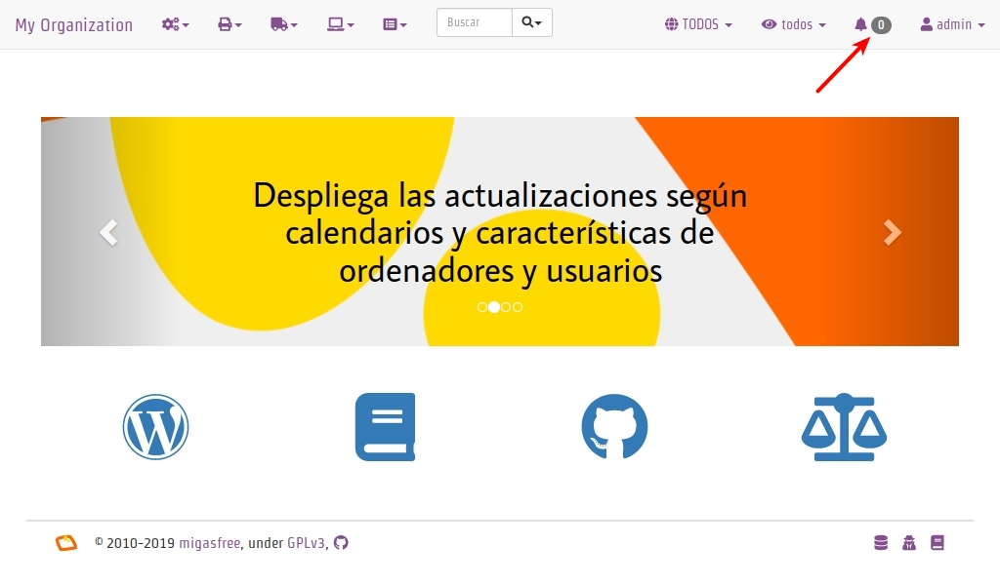
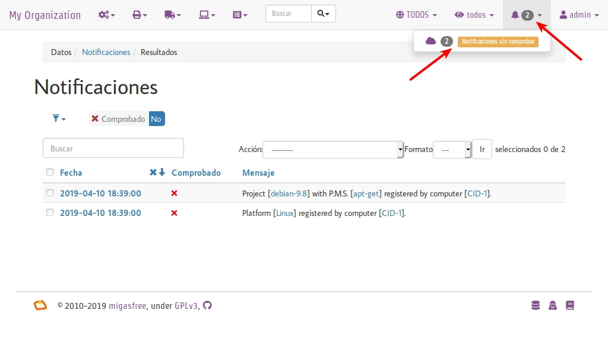
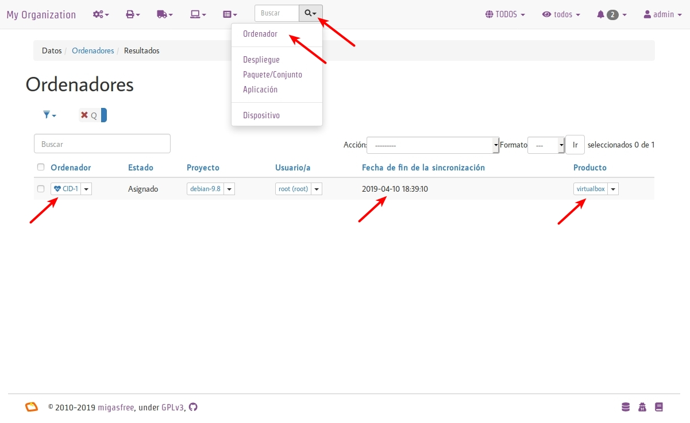

## Probando migasfree

> La unidad es la variedad, y la variedad en la unidad es la ley
> suprema del universo.
>
> -- Isaac Newton.

El objetivo de este capítulo es que dispongas rápidamente de un servidor
y un cliente *migasfree* totalmente funcional, por eso no me voy a
extender en explicaciones.

!!! note "nota"
    Usa una máquina virtual de [virtualbox](https://www.virtualbox.org/)
    realizando la instalación mínima por red de
    [Debian](http://www.debian.org/) 64 bits para ver el funcionamiento de
    *migasfree* y familiarizarte con él antes de poner a
    Migasfree en producción


### Instalando el servidor


Si ahora no quieres preocuparte de cómo se realiza esta instalación,
nunca has usado [docker](https://www.docker.com/) o, simplemente,
quieres avanzar más rápido, te proporcionamos este [Open Virtual
Appliance
(OVA)](https://drive.google.com/open?id=1vymsLjNqKgWcy2oahc20d83NZTuphCNG)
para que lo ejecutes con *virtualbox*. Contiene un servidor *migasfree*
ya instalado.

Con *virtualbox* instalado, y una vez descargado el fichero OVA, haz
doble click en él y, a continuación, observa las siguientes reglas de
reenvío de puertos accediendo al menú de *virtualbox*:
configuración-red-avanzadas-reenvío de puertos:

```
Nombre   Protocolo    IP anfitrión  Puerto  IP invitado  Puerto invitado
=======  =========    ============  ======  == ========  ===============
Rule 1   TCP          127.0.0.1     2222    10.0.2.15    22
Rule 2   TCP          127.0.0.1     8080    10.0.2.15    80
```

Ya puedes arrancar la máquina virtual.

Los usuarios y contraseñas de esta máquina virtual son: tux:tux y
root:root.

Para acceder por SSH a esta máquina virtual usa:

``` bash
ssh -p 2222 tux@127.0.0.1
```

Una vez dentro, puedes loguearte como `root` de la siguiente manera:

``` bash
tux@migasfree:~$ su
```

Para acceder al servidor web instalado en esta máquina virtual, usa la
URL <http://127.0.0.1:8080> desde el equipo anfitrión.

Ahora bien, si quieres hacer la instalación tú mismo, accede a la
máquina debian 64 bits sobre la que vas a instalar el servidor y sigue
los pasos indicados en
[migasfree-docker](https://github.com/migasfree/migasfree-docker).

### Comprobando el servidor


En un navegador web accede a la URL del servidor. Si todo ha ido bien,
verás algo similar a la imagen 'Acceso al servidor migasfree'.

{: .center}
*Acceso al servidor migasfree*{: .center}


Pulsa en `iniciar sesión` y haz login con el *nombre de usuario* "admin"
y *contraseña* "admin". Verás algo parecido a la imagen 'Estado del
servidor con 0 alertas'. Observa como arriba a la derecha pone
`alertas 0`. Esto nos indica que todo está controlado.

{: .center}
*Estado del servidor con 0 alertas*{: .center}


### Instalando el cliente


#### Instalando el paquete migasfree-client

Ahora instala el cliente *migasfree* sobre la misma máquina donde has
instalado el servidor. Para ello, actualiza la lista de paquetes e
instala el paquete `migasfree-client`:

``` bash
# wget -O - http://migasfree.org/pub/install-client | bash
```

También puedes instalar el cliente en cualquier otra máquina y editar el
fichero `/etc/migasfree.conf` manualmente para configurarlo. Descomenta
la línea `# Server = localhost` y asígnale la dirección del servidor
web. Te hago notar que esta **no es la manera** en que debemos hacerlo,
pero por ahora puede servirnos. La manera correcta sería empaquetar
dicha modificación, cosa que veremos más adelante en
Configurando migasfree-client

!!! note "nota"
    Cualquier cambio en la configuración de las aplicaciones o del S.O se
    podrán realizar de manera centralizada con suma facilidad, manteniendo
    además la integridad, sólo si dicha configuración ha sido empaquetada.

#### Registrando el cliente

Ejecuta el comando:

``` bash
# migasfree -u
```

te devolverá una salida parecida a esta:

``` bash
root@migasfree:/home/tux# migasfree -u
Sesión gráfica no detectada
Versión de migasfree client: 4.15

Opciones de ejecución: /etc/migasfree.conf
    Proyecto: debian-9.3
    Servidor: localhost
    Actualizar paquetes automáticamente: True
    Proxy: None
    Certificado SSL: None
    Proxy caché de paquetes: None
    Depuración: False
    Nombre del ordenador: migasfree
    GUI detallado: True
    PMS: apt-get

    Usuario gráfico: root

Autoregistrando ordenador...
¡Clave /var/migasfree-client/keys/localhost/debian-9.3.pri creada!
¡Clave /var/migasfree-client/keys/localhost/server.pub creada!
Warning: apt-key output should not be parsed (stdout is not a terminal)
¡Clave /var/migasfree-client/keys/localhost/repositories.pub creada!

******************* Conectando al servidor migasfree... ********************
***************************** Correcto

************************ Obteniendo propiedades... *************************
***************************** Correcto

************************** Evaluando atributos... **************************
PCI: 8086:1237~Host bridge: Intel Corporation 440FX - 82441FX PMC [Natoma] (rev 02) ,8086:7000~ISA bridge: Intel Corporation 82371SB PIIX3 ISA [Natoma/Triton II] ,8086:7111~IDE interface: Intel Corporation 82371AB/EB/MB PIIX4 IDE (rev 01) ,80ee:beef~VGA compatible controller: InnoTek Systemberatung GmbH VirtualBox Graphics Adapter ,8086:100e~Ethernet controller: Intel Corporation 82540EM Gigabit Ethernet Controller (rev 02) ,80ee:cafe~System peripheral: InnoTek Systemberatung GmbH VirtualBox Guest Service ,106b:003f~USB controller: Apple Inc. KeyLargo/Intrepid USB ,8086:7113~Bridge: Intel Corporation 82371AB/EB/MB PIIX4 ACPI (rev 08) ,8086:2829~SATA controller: Intel Corporation 82801HM/HEM (ICH8M/ICH8M-E) SATA Controller [AHCI mode] (rev 02) ,

HST: migasfree

NET: 10.0.2.0/24


************************** Subiendo atributos... ***************************
***************************** Correcto

*************************** Ejecutando fallas... ***************************
LOW_HOME_PARTITION_SPACE:
LOW_SYSTEM_PARTITION_SPACE:

**************************** Subiendo fallas... ****************************
***************************** Correcto

************************* Creando repositorios... **************************
***************************** Correcto

************* Obteniendo los metadatos de los repositorios... **************
Ign:1 http://ftp.es.debian.org/debian stretch InRelease
Obj:2 http://security.debian.org/debian-security stretch/updates InRelease
Obj:3 http://ftp.es.debian.org/debian stretch-updates InRelease
Obj:4 http://ftp.es.debian.org/debian stretch Release
Obj:5 https://download.docker.com/linux/debian stretch InRelease
Leyendo lista de paquetes... Hecho
***************************** Correcto

************************ Desinstalando paquetes... *************************
***************************** Correcto

******************* Instalando paquetes obligatorios... ********************
***************************** Correcto

************************* Actualizando paquetes... *************************
DEBIAN_FRONTEND=noninteractive /usr/bin/apt-get -o APT::Get::Purge=true -o Dpkg::Options::=--force-confdef -o Dpkg::Options::=--force-confold -o Debug::pkgProblemResolver=1 --assume-yes --force-yes --allow-unauthenticated --auto-remove dist-upgrade
Leyendo lista de paquetes...
Creando árbol de dependencias...
Leyendo la información de estado...
Calculando la actualización...
0 actualizados, 0 nuevos se instalarán, 0 para eliminar y 0 no actualizados.

***************************** Correcto

****************** Subiendo el inventario del software... ******************
***************************** Correcto

*************** Capturando información sobre el hardware... ***************
***************************** Correcto

**************** Enviando información sobre el hardware... ****************
***************************** Correcto

************************* Operaciones completadas **************************
```

### Comprobando el estado del servidor


Comprueba los datos que se han recogido accediendo al servidor con tu
navegador web.

* Fíjate ahora que tienes 2 `Alertas` (ver imagen notificaciones). Pulsa sobre ellas y
luego sobre `2 alertas por comprobar`:

    -   La primera te notifica que el ordenador `CID-1` ha dado de alta la
        plataforma `Linux`.
    -   La segunda notificación te dice que el ordenador `CID-1` ha
        añadido el proyecto `debian-x.x`.


{: .center}
*Notificaciones*{: .center}


* Echa un vistazo rápido al ordenador pulsando en la `lupa` y luego en
`ordenador` (ver imagen Ordenadores)

    -   Observa los datos del ordenador pulsando sobre `CID-1`.
    -   Fíjate en la fecha de la sicronización.
    -   Consulta el `hardware` pulsando sobre el campo `producto`.


{: .center}
*Ordenadores*{: .center}

!!! note "nota"
    CID es un acrónimo de `Computer IDentificator`. Es un número que el
    servidor asigna a cada ordenador para identificarlo. Es imposible
    tener dos ordenadores con el mismo CID.


!!! note "nota"
    El símbolo que aparece a la izquierda del CID (el corazón) indica el
    `estado` en el que encuentra el ordenador.


¡Enhorabuena! Has instalado un servidor migasfree y has registrado en él
tu primer ordenador.

### Desplegando software

Y ahora, para ir abriendo boca, vamos a instalar y eliminar aplicaciones
de manera centralizada usando el servidor *migasfree*.

Supón que quieres sustituir `nano` por `vim` en todos los equipos de tu
organización.

Accede a `Liberación - Despliegues` y pulsa en en símbolo `+` para
añadir un despliegue.

!!! note "nota"
    Sitúa el cursor sobre los iconos del formulario de despliegue para
    identificar cada campo.

Introduce los siguientes datos:

-   `Nombre`: sustituir nano por vim
-   `proyecto`: (el que corresponda)
-   `paquetes a instalar`: vim
-   `paquetes a desinstalar`: nano
-   `atributos incluidos`: ALL SYSTEMS

Graba el despliegue.

Ahora `sincroniza` el equipo cliente con el servidor *migasfree*:

``` bash
# migasfree -u
```

Puedes comprobar en la salida estándar del cliente migasfree que se ha
configurado el repositorio `sustituir-nano-por-vim` y que se ha
instalado el paquete `vim` y desinstalado `nano`.

``` bash
************* Obteniendo los metadatos de los repositorios... **************
Obj http://localhost sustituir-nano-por-vim InRelease
Des:1 http://localhost sustituir-nano-por-vim/PKGS amd64 Packages [29 B]

************************ Desinstalando paquetes... *************************
Los siguientes paquetes se ELIMINARÁN:
  nano*
***************************** Correcto

******************* Instalando paquetes obligatorios... ********************
Se instalarán los siguientes paquetes NUEVOS:
  vim
***************************** Correcto

```

!!! note "nota"
    En el despliegue que acabamos de hacer sólo hemos dado la orden de
    instalar y desinstalar paquetes, pero además se ha creado un
    repositorio de paquetes `vacío`. En los siguientes capítulos
    aprenderás a subir tus propios paquetes al servidor e introducirlos en
    los despliegues, pero vayamos despacito, suave, suavecito.


Al poner el atributo `SET-ALL SYSTEMS` estamos indicando que se aplique
este despliegue a todos los ordenadores. Podríamos haber incluido otros
atributos como `CID-1`, `NET-10.0.2.0/24`, o una lista de ellos. Sólo se
aplicará este despliegue a los ordenadores que tengan algún atributo
coincidente con los atributos incluidos en el despliegue.

Observa que también puedes excluir ordenadores. El servidor sigue la
siguiente lógica: primero comprueba los ordenadores incluidos y después
excluye los ordenadores que tenga algún atributo que coincida con los
atributos excluidos del despliegue.

!!! note "nota"
    Ahora cada vez que un ordenador se sincroniza con el servidor (y se le
    aplica este despliegue), se instala `vim` y desinstala `nano` si es
    necesario.

Si ahora queremos instalar `vim` y `emacs` en todos los ordenadores,
pon sus nombres en `paquetes a instalar` y deja en blanco
`paquetes a desinstalar`:

  -   `paquetes a instalar`: vim emacs
  -   `paquetes a desinstalar`:

Conforme los equipos se vayan sincronizando, se producirán los cambios.

Aprenderás más sobre los despliegues en el capítulo dedicado a
La Liberación.

¡Enhorabuena de nuevo! Ya sabes como instalar/desinstalar software de
manera centralizada a un conjunto de ordenadores. No está nada mal para
empezar, ¿no crees?

En el siguiente capítulo vas a aprender a hacer el cambio de
configuración software al **estilo migasfree**.
